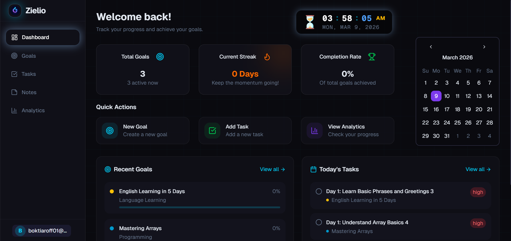

# ⚡ Zielio



<div align="center">

**The Operating System for Ambitious Students**

[](https://nextjs.org/)
[](https://convex.dev/)
[](https://www.typescriptlang.org/)
[](https://tailwindcss.com/)
[](LICENSE)

[View Demo](https://goal-tracker-01.vercel.app) · [Report Bug](https://github.com/BHSajuu/GoalTracker/issues) · [Request Feature](https://github.com/BHSajuu/GoalTracker/issues)

</div>

---

## 🚀 About The Project

**Zielio** (formerly GoalTracker) is not just another to-do list. It is an intelligent productivity platform designed specifically for students and developers who want to stop dreaming and start shipping.

Built with a modern stack (**Next.js 16 + Convex**), Zielio leverages **Generative AI** to transform vague ambitions into concrete, actionable roadmaps. It solves the "overwhelm" problem by intelligently scheduling your day based on your actual availability and deadlines.

### ✨ Key Features

* **🤖 AI Powered Goal Creation**
    * Transform vague ideas (e.g., "Learn React") into concrete roadmaps. Our AI agent breaks down huge ambitions into manageable, actionable tasks instantly.
* **📅 Plan My Day Algorithm**
    * Overwhelmed by a long list? Our smart algorithm analyzes your pending tasks, deadlines, and available hours to curate the perfect daily schedule for you.
* **⏳ AI Powered Overdue Scheduler**
    * Fell behind? No problem. Our background AI agent automatically detects overdue tasks and intelligently reschedules them ensuring you never lose momentum.
* **📊 Visual Analytics**
    * Don't just guess. See your efficiency trends, completion rates, and focus distribution in real-time with beautiful interactive charts.
* **📝 Rich Notes**
    * Attach diagrams, screenshots, and resource links directly to your goals. Keep your learning resources exactly where your work is.

---

## 🛠️ Tech Stack

* **Framework:** [Next.js 16](https://nextjs.org/) (App Router)
* **Backend & Database:** [Convex](https://convex.dev/) (Real-time, reactive backend)
* **Authentication:** Custom Auth via OTP
* **Styling:** [Tailwind CSS](https://tailwindcss.com/)
* **UI Components:** [Shadcn UI](https://ui.shadcn.com/) & [Lucide React](https://lucide.dev/)
* **Charts:** [Recharts](https://recharts.org/)
* **Animation:** Tailwind Animate & Framer Motion concepts

---

## 🏁 Getting Started

Follow these steps to set up the project locally on your machine.

### Prerequisites

* Node.js (v18 or higher)
* npm or bun

### Installation

1.  **Clone the repository**
    ```bash
    git clone https://github.com/BHSajuu/GoalTracker.git
    cd GoalTracker
    ```

2.  **Install dependencies**
    ```bash
    npm install
    # or
    bun install
    ```

3.  **Environment Setup**
    Create a `.env.local` file in the root directory and add your Convex deployment URL:
    ```env
    # .env.local
    CONVEX_DEPLOYMENT=your_convex_deployment_url
    NEXT_PUBLIC_CONVEX_URL=your_public_convex_url
    ```

4.  **Start the Backend**
    Run the Convex development server to sync your schema and functions:
    ```bash
    npx convex dev
    ```

5.  **Start the Frontend**
    In a new terminal window, start the Next.js development server:
    ```bash
    npm run dev
    ```

6.  **Open the App**
    Visit `http://localhost:3000` in your browser.

---

## 📂 Project Structure

```bash
├── app/                  # Next.js App Router pages
│   ├── dashboard/        # Protected application routes
│   │   ├── analytics/    # Visual data visualization
│   │   ├── goals/        # Goal management views
│   │   ├── tasks/        # Task planning & listing
│   │   └── notes/        # Knowledge base
│   └── page.tsx          # Landing page
├── components/           # Reusable UI components
│   ├── analytics/        # Charting components
│   ├── dashboard/        # Sidebar, Header, Stats
│   └── ui/               # Shadcn UI primitives
├── convex/               # Backend logic
│   ├── schema.ts         # Database schema definition
│   ├── tasks.ts          # Task CRUD & logic
│   ├── goals.ts          # Goal management
│   ├── agent.ts          # AI agent logic
│   └── scheduler.ts      # Scheduling algorithms
└── public/               # Static assets