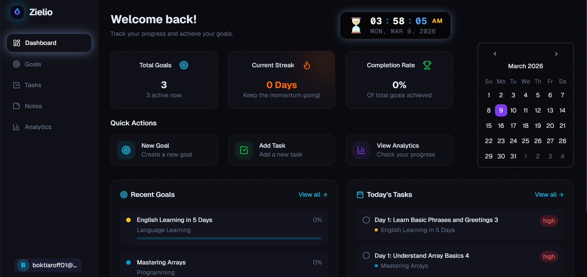

# ⚡ Zielio



<div align="center">

**The Operating System for Ambitious Students & Developers**

[](https://nextjs.org/)
[](https://convex.dev/)
[](https://www.typescriptlang.org/)
[](https://tailwindcss.com/)
[](LICENSE)

[View Demo](https://goal-tracker-01.vercel.app) · [Report Bug](https://github.com/BHSajuu/GoalTracker/issues) · [Request Feature](https://github.com/BHSajuu/GoalTracker/issues)

</div>

---

## 🚀 About The Project

**Zielio** (formerly GoalTracker) is not just another to-do list. It is an intelligent productivity platform designed specifically for students and developers who want to stop dreaming and start shipping.

Built with a modern, real-time stack (**Next.js 16 + Convex**), Zielio leverages **Generative AI** and advanced deterministic algorithms to transform vague ambitions into concrete, actionable roadmaps. It solves the "overwhelm" problem by dynamically managing your schedule, tracking your true focus efficiency, and organizing your knowledge base in one unified workspace.

---

## ✨ Core Features & Capabilities

### 🧠 Core AI Integrations
* **🤖 Hybrid AI Scheduling Agent (Chronological Repacking)**
    * **The Problem:** You fell behind on your schedule. 
    * **The Solution:** Our "Schedule Healing" algorithm detects drift and rebalances your workload. By using AI for heuristic sorting and strict TypeScript math for bin-packing, it chronologically repacks your missed tasks into future days without violating your daily time capacities or breaking goal dependencies. Fully timezone-aware.
* **🎯 AI-Powered Goal Breakdown**
    * Transform vague ideas (e.g., "Learn Next.js") into concrete roadmaps instantly. The AI agent breaks down massive ambitions into manageable, bite-sized tasks with smart time estimations.
* **💡 "Ask AI" Analytics Insights**
    * Don't just look at charts. Click the **Ask AI** button on your analytics dashboard to get a personalized, LLM-generated breakdown of your productivity trends, bottlenecks, and actionable advice based entirely on your actual data.
* **👁️ AI Image Analysis**
    * Upload a screenshot of a diagram, textbook page, or complex code block, and use the built-in AI Image Analysis feature to extract text, summarize concepts, or explain the visual data directly into your notes.

### 📝 The Knowledge Base & Collaboration
* **📂 Multi-Modal Notes System**
    * A robust notes system powered by Convex File Storage. Attach dedicated Code Snippets (with syntax highlighting), Image galleries, and Link collections (with YouTube video previews) directly to your goals.
* **🔗 Secure Note Sharing & Cloning**
    * Generate secure, public read-only links for any note, or send them directly to colleagues via beautifully styled, automated Zielio emails.
    * **Save to Workspace:** Authenticated visitors can instantly clone shared notes directly into their own Zielio goals with a single click.
* **🏷️ Interactive Inline Image Tagging**
    * Write context-rich text notes using our custom TipTap editor. Use the "Tag Image" extension to drop interactive pills (e.g., `📸 Image 1`) directly inline with your text. Clicking these tags instantly opens the referenced image in a full-screen lightbox.

### ⏱️ The Productivity Engine
* **📅 Plan My Day Algorithm**
    * Overwhelmed by a long list? Our smart algorithm analyzes your pending tasks, deadlines, and available hours to curate the perfect daily schedule for you.
* **⏳ Deep-Integration Focus Timer**
    * Not just a basic countdown. The Focus Timer locks you into a specific task, tracks your exact active session time, and directly feeds this data back into the database to power your efficiency metrics.
* **🔮 Predictive Analytics (The Estimation Multiplier)**
    * Stop guessing how long tasks take. The system algorithmically analyzes your past Focus Timer sessions (comparing your Estimated vs. Actual time) to calculate a personal "Estimation Multiplier". It uses this historical data to predict how long your future tasks will actually take based on your real-world pacing.
* **🔔 Web Push Notifications**
    * Stay accountable with OS-level push notifications for task reminders, streak savers, and AI quota alerts, even when the browser is closed.

### 📊 Data & Security
* **📈 Visual Analytics Dashboard**
    * See your efficiency trends, completion rates, and focus distribution in real-time with beautiful interactive charts built with Recharts.
* **🔒 Privacy-First Data Vault**
    * Export your entire productivity history as a JSON file anytime. Secure, OTP-verified account deletion with complete database hygiene (cascade-deleting all associated tasks, goals, images, and notes).

---

## 🛠️ Tech Stack

**Frontend Environment:**
* **Framework:** [Next.js 16](https://nextjs.org/) (App Router)
* **Language:** TypeScript
* **Styling:** [Tailwind CSS](https://tailwindcss.com/) v4
* **UI Components:** [Shadcn UI](https://ui.shadcn.com/), [Radix UI](https://www.radix-ui.com/) & [Lucide React](https://lucide.dev/)
* **Animations:** Framer Motion & Tailwind Animate
* **Rich Text Editor:** Tiptap (with Custom Extensions) & React Syntax Highlighter

**Backend & Data:**
* **Database & Real-time:** [Convex](https://convex.dev/) (Reactive backend & File Storage)
* **AI Integration:** NVIDIA API 
* **Authentication:** Custom OTP Authentication (Nodemailer + Input-OTP)
* **Data Validation:** Zod + React Hook Form
* **Notifications:** Web Push API via Service Workers

---

## 🏁 Getting Started

Follow these steps to set up the project locally on your machine.

### Prerequisites

* Node.js (v18 or higher)
* npm

### Installation

1.  **Clone the repository**
    ```bash
    git clone https://github.com/BHSajuu/GoalTracker.git
    cd GoalTracker
    ```

2.  **Install dependencies**
    ```bash
    npm install
    ```

3.  **Environment Setup**
    Create a `.env.local` file in the root directory and add your Convex deployment URL, AI API keys, and Email credentials:
    ```env
    # .env.local
    CONVEX_DEPLOYMENT=your_convex_deployment_url
    NEXT_PUBLIC_CONVEX_URL=your_public_convex_url
    NVIDIA_MISTRAL_API_KEY=your_nvidia_or_openai_api_key
    SMTP_USER=your_email_address
    SMTP_PASS=your_app_password
    NEXT_PUBLIC_VAPID_PUBLIC_KEY=your_vapid_public_key
    ```

4.  **Start the Backend**
    Run the Convex development server to sync your schema and functions:
    ```bash
    npx convex dev
    ```

5.  **Start the Frontend**
    In a new terminal window, start the Next.js development server:
    ```bash
    npm run dev
    ```

6.  **Open the App**
    Visit `http://localhost:3000` in your browser.

---

## 📁 Project Structure highlights
* `/app`: Next.js App Router pages (Dashboard, Analytics, Tasks, Notes, Share Routes).
* `/components`: Reusable UI components, heavily modularized (e.g., specialized note cards, AI generators, interactive dialogs).
* `/convex`: Backend logic, database schemas, server actions (AI integrations, Email sending), and complex mutations.
* `/lib`: Utility functions and context providers.
* `/hooks`: Custom React hooks (e.g., `usePushNotifications`, `useAIGate`).